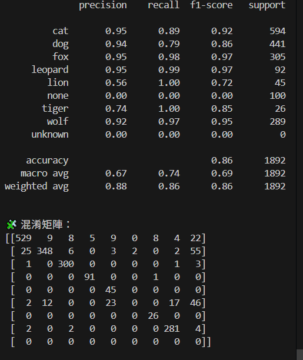
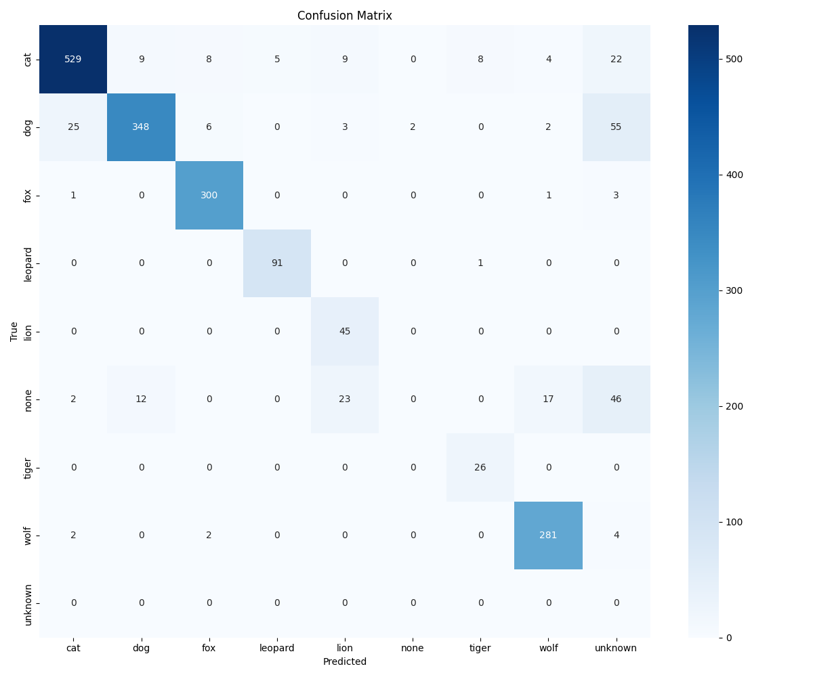

# 多類別動物影像分類系統：基於 MobileNetV2 的遷移學習應用

本專案開發一套具備高準確度與邊界安全性的動物影像分類模型。除了針對常見的犬科（Canidae）與貓科（Felidae）進行細分，更引入了 **"Unknown"（信心度過低）** 與 **"None"（非目標輸入）** 的邏輯判斷，以提升系統在實際應用場景中的容錯能力與安全性。

## 研究動機
* **技術應用價值：** 影像分類在醫療、工業及動物園智慧導覽（辨識與管理）等領域具備實際應用潛力。
* **解決相似混淆：** 針對外觀相近的物種（如狗與狼、貓與豹），傳統模型易誤判，本專案致力於提升特定角度下的辨識率。
* **強化系統可靠性：** 實際場景中常有非預期輸入（如人、黃鼠狼等），若強行分類會降低系統信賴度。本專案透過邊界安全邏輯，有效排除非目標影像。

## 技術架構與方法

### 1. 資料處理
* **資料蒐集：** 使用 `icrawler` 套件從 Bing 搜尋引擎批次下載圖像，並依類別建立結構化資料夾。
* **資料增強：** 透過 TensorFlow 的 `ImageDataGenerator` 進行旋轉、翻轉、縮放等處理，增加樣本多樣性，防止過擬合（Overfitting）。

### 2. 模型架構
採用 **MobileNetV2** 作為 Backbone 進行遷移學習：
* **輸入層：** 224x224 RGB 圖像。
* **特徵提取：** 預訓練的 MobileNetV2（不含原頂層分類層）。
* **自定義層：** 新增 `GlobalAveragePooling2D`、`Dropout` 防止過擬合。
* **輸出層：** `Dense` 層（8 units），使用 `Softmax` 激活函數。

### 3. 分類類別與邏輯
本模型支援以下 8 類目標及特殊判斷邏輯：
* **Felidae (貓科)：** Cat, Leopard, Tiger, Lion
* **Canidae (犬科)：** Dog, Wolf, Fox
* **None (其他)：** 非上述目標之影像（如人、黃鼠狼等）。
* **Unknown (未知)：** 若模型預測之最高信心值 **< 0.5**，則強制輸出為 `unknown`。

---

## 程式功能說明

* **`download_images.py`**：利用 `icrawler` 根據關鍵字自動下載並分類圖片。
* **`train_model.py`**：建構模型、實施資料增強與遷移學習，並將訓練好的模型存為 `.h5` 檔。
* **`predict.py`**：支援單張圖片路徑輸入，進行類別預測與信心值分析。
* **`evaluate_model.py`**：讀取模型與測試集，輸出 **Precision、Recall、F1-score** 及 **混淆矩陣 (Confusion Matrix)**，並生成可視化報表。

---

## 實驗流程與結果

### 實驗流程
1. **數據整理：** 影像採集與人工初步過濾。
2. **預處理：** 圖像 Resize 至 224x224 並進行歸一化 (Normalization)。
3. **訓練驗證：** 將資料集按 **8:2** 比例分割為訓練集與驗證集。
4. **效能評估：** 採用未曾見過的第三方圖片進行測試。

##實驗結果與分析

本專案使用 1,892 張完全陌生的影像進行測試，整體模型 **準確度 (Accuracy) 達到 86%**。以下為詳細的效能分析：

### 1. 效能指標解釋
在解讀數據前，本專案採用的評估標準如下：

| 指標 | 白話解釋 | 重點用途 |
| :--- | :--- | :--- |
| **Precision (精確率)** | 預測為某類中，有多少是真的？ | 看「準不準」，預測該類時有沒有常猜錯。 |
| **Recall (召回率)** | 真正該被預測成該類的圖，抓出多少？ | 看「抓得全不全」，有沒有漏抓。 |
| **F1-score** | Precision 和 Recall 的綜合成績。 | 全面表現的平均值，平衡精確與召回。 |
| **Accuracy (整體準確率)** | 所有預測中，總共猜對幾張 / 總張數。 | 評估模型整體表現。 |

---

### 2. 分類報表 (Classification Report)
根據測試結果，模型在各物種的辨識表現如下：

| 類別 (Category) | Precision | Recall | F1-score | Support (樣本數) |
| :--- | :---: | :---: | :---: | :---: |
| **Cat (貓)** | 0.95 | 0.89 | 0.92 | 594 |
| **Dog (狗)** | 0.94 | 0.79 | 0.86 | 441 |
| **Fox (狐狸)** | 0.95 | 0.98 | 0.97 | 305 |
| **Leopard (豹)** | 0.95 | 0.99 | 0.97 | 92 |
| **Lion (獅子)** | 0.56 | 1.00 | 0.72 | 45 |
| **Wolf (狼)** | 0.92 | 0.97 | 0.95 | 289 |
| **Tiger (老虎)** | 0.74 | 1.00 | 0.85 | 26 |
| **None (非目標)** | 0.00 | 0.00 | 0.00 | 100 |
| **Weighted Avg** | **0.88** | **0.86** | **0.86** | **1892** |

> **註：** `none` 與 `unknown` 類別主要作為過濾器使用，旨在提升邊界安全性。

---

### 3. 混淆矩陣 (Confusion Matrix) 分析
透過混淆矩陣，我們能深入了解模型在哪些類別之間容易產生誤判：

* **貓科與犬科的混淆：** `cat` 有少量樣本被誤認為 `dog` 或 `fox`，顯示外觀相似性在特定角度仍具挑戰。
* **Unknown 判斷邏輯：**
    * `dog` 類別中有 55 張被判定為 `unknown`，主因可能是圖像中出現了遮擋物（如嘴套或草叢）。
    * `cat` 類別則有 22 張進入 `unknown`。
* **None 類別的局限：** 模型目前對於非目標圖片（`none`）的辨識度較弱，有 23 次將其誤認為 `lion`。這顯示未來需要增加更多樣化的 `none` 類別樣本進行訓練。
* **高準確率類別：** `fox`、`leopard` 與 `tiger` 展現了極高的辨識穩定度，幾乎無誤判。

---

### 4. 實驗結論
1.  **實用性高：** 在完全未見過的測試集上維持 86% 準確率，證明 MobileNetV2 遷移學習的有效性。
2.  **安全性提升：** 引入 `unknown` 門檻值（< 0.5）成功過濾了 130 餘張特徵不明確的影像，有效避免模型「硬猜」導致的嚴重錯誤。
3.  **優化方向：** 未來將著重於擴展 `none` 類別的資料庫，並針對 `lion` 與其他非目標影像的特徵差異進行微調。

---

## 參考資料
1. TensorFlow 學習筆記 (1) feature_column, 2018-03-21.
2. 李君涵 (Chun-Han Lee), *Ground image recognition model based on texture feature*, 國立臺灣大學生物資源暨農學院農藝學系學士論文, 2021.
3. 洪修德 (Hsiu-Te Hung), *Pet cat behavior recognition based on YOLO model*, 朝陽科技大學資訊管理系碩士論文, 2021. 指導教授：陳榮靜 (Rung-Ching Chen).
